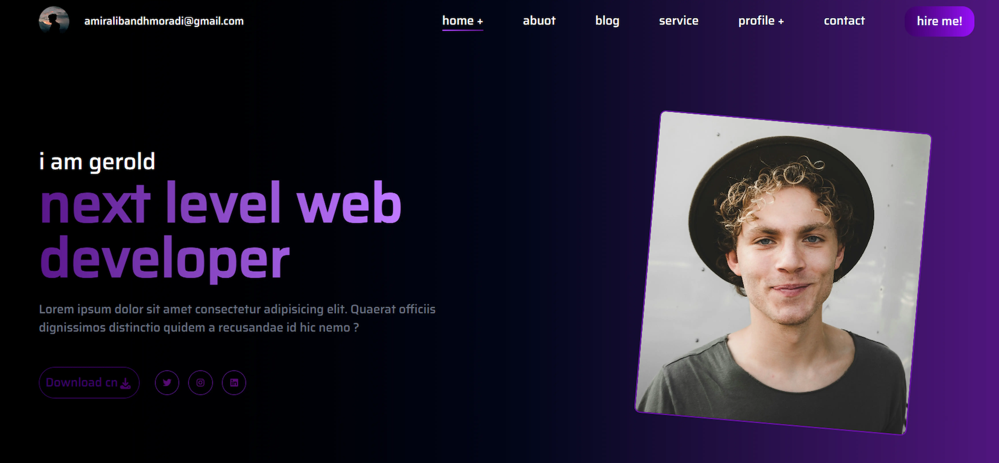

# 🌐 Personal Portfolio Website

  

🚀 A modern and professional personal portfolio website built to showcase work experience, skills, and completed projects in a clean and structured format.  
This project reflects a strong focus on usability, modern design principles, and front-end best practices.

---

## 🛠️ Tech Stack

This website is built using modern front-end technologies:

- ⚡ **HTML5** – Semantic and accessible structure  
- 🎨 **CSS3 & Tailwind CSS** – Responsive, clean, and scalable design  
- 🧠 **JavaScript (Vanilla JS)** – Dynamic behavior and smooth user interactions  

---

## ✨ Features

- 📱 Fully responsive design for all screen sizes  
- 🎯 Minimal and professional user interface  
- 🧩 Clear presentation of experience and completed work  
- 🚀 Optimized performance and smooth navigation  
- 🎨 Modern UI with attention to UX details  

---

## 🎯 Purpose

The main goals of this project are:

- To present professional experience and technical skills  
- To showcase real-world projects in a structured way  
- To build a strong and reliable personal digital presence  

---

## 📈 Scalability & Future Enhancements

- Easy to extend with new sections or projects  
- Ready for animations and UI improvements  
- Can be integrated with backend services or contact forms  

---

## 🤝 Feedback

Feedback and suggestions are always welcome to help improve and evolve this project.

---

⭐ This project demonstrates clean code, modern front-end development practices, and portfolio-ready design.
